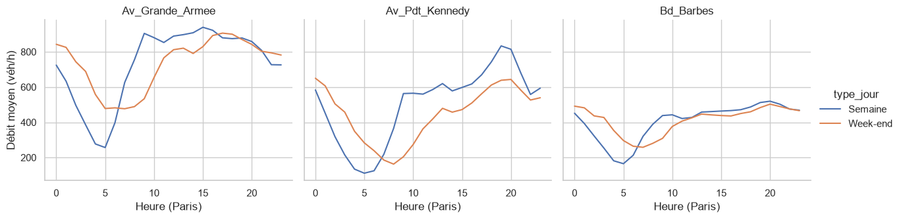
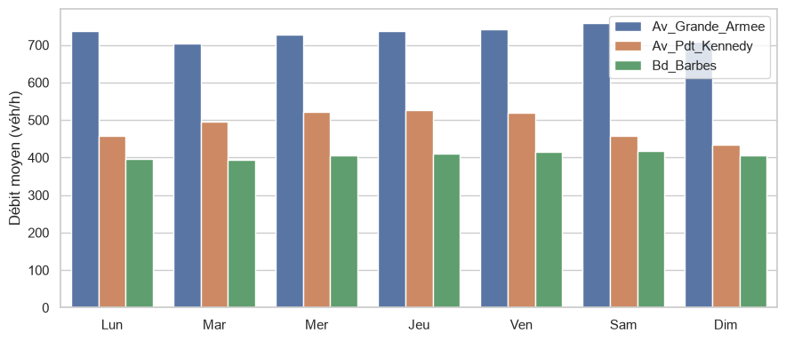
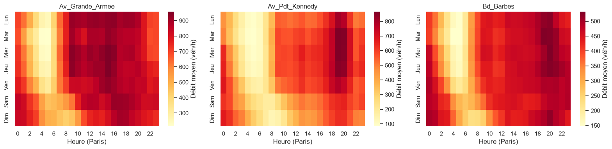
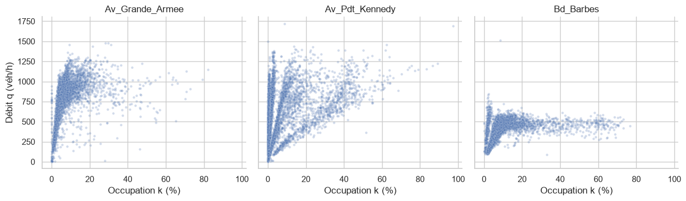

# Trafic routier à Paris : Bd Barbes, Av. du Président Kennedy, Av. de la Grande Armée

> Projet du module Analyse et Transformation de Données (MSc DM2). Avancement : chargement (M1), nettoyage (M2) et transformation (M3) terminés ;  l'analyse du trafic selon l'heure et le jour terminée.

## La question
Comment le trafic évolue-t-il selon l'heure et le jour (semaine / week-end) sur trois axes parisiens de nature différente qui sont un boulevard urbain (Bd_Barbes), un axe de transit (Av_Pdt_Kennedy) et une entrée d'agglomération (Av_Grande_Armee) ?

## Les données
- **Source** : [comptages routiers permanents de la Ville de Paris](https://opendata.paris.fr/explore/dataset/comptages-routiers-permanents/) (boucles électromagnétiques, mesures horaires).
- **Axes** : Bd_Barbes (12 tronçons), Av_Pdt_Kennedy (6), Av_Grande_Armee (4), soit 22 tronçons.
- **Période** : du 1er mars au 31 août 2026.
- **Volume** : 95 960 lignes brutes, 4 416 heures attendues par tronçon.

## Pièges rencontrés

- **Fuseau horaire** : les dates sont en UTC (+00:00). Je les convertis en heure de Paris, et je l'ai vérifié sur le 29 mars (changement d'heure : 23 h en heure de Paris, 24 h en UTC).
- **Valeurs manquantes** : q (débit) manque dans 3,6 % des lignes et k (occupation) dans 9,6 %. Les 3 202 lignes Invalide ont q et k vides ; Barré (100 lignes) garde un débit renseigné.
- **Inconnu = k manquant** : les 9 169 lignes etat_trafic = Inconnu sont exactement celles où k est vide. C'est une valeur manquante déguisée en texte, transformée en NaN`.
- **Heures absentes du fichier** : 52 heures manquent pour tous les capteurs, en 4 épisodes (24 h, 24 h, 3 h, 1 h). J 'ai reconstruis une grille complète capteur × heure (97 152 lignes) avant toute interpolation.
- **Interpolation** : limitée aux trous de 3 h ou moins entre deux mesures réelles ; les longues pannes restent vides. Les valeurs reconstituées sont marquées (q_comble, k_comble) et les colonnes d'origine sont conservées.
- **Doublons cachés** : aucune ligne dupliquée, mais le débit q ne compte que 13 séries différentes pour 22 tronçons (6 sur 12 pour Bd_Barbes, 3 sur 6 pour Av_Pdt_Kennedy, 4 sur 4 pour Av_Grande_Armee). Le débit semble recopié entre tronçons voisins ; groupe_q repère ces groupes, et les moyennes par axe ne comptent qu'une fois chaque série.
- **Capteur 5258 (Av_Grande_Armee)** : k est absent sur 98 % de ses heures.
- **Valeurs aberrantes** : l'IQR signale 580 valeurs, mais 534 sont des nuits calmes normales (trop basses, surtout entre 3 h et 5 h). Je ne retire que 2 valeurs à 5 421,95 véh/h (capteurs 1629 et 1631, même mesure recopiée) :débit non entier, supérieur à 2 000 et incompatible avec l'occupation mesurée. Elles sont mises à `NaN`.
- **Colonnes supprimées** : les colonnes de carrefours décrivent le réseau et iu_ac suffit à identifier un tronçon ; t_utc contient la même information que t_paris.

## Résultats
Les chiffres sont des débits horaires moyens (véhicules/heure) en heure de Paris ; chaque série de débit partagée entre tronçons n'est comptée qu'une fois.

### Le trafic est selon l'heure. Le débit est au plus bas vers 4-5 h. En semaine, Av_Pdt_Kennedy et Bd_Barbes ont leur pointe en soirée (19-20 h), alors qu'Av_Grande_Armee monte dès 7-9 h et reste chargée toute la journée, avec un maximum vers 15 h . Le week-end, le matin démarre plus tard et plus bas (à 8 h : environ 163 contre 366 en semaine sur Av_Pdt_Kennedy), mais la nuit est plus chargée, et le soir le trafic rejoint le niveau de la semaine.



**Le trafic selon le jour.** Le jour de la semaine change peu le débit moyen ; l'heure compte davantage. Av_Pdt_Kennedy est le plus sensible : environ 520 véh/h de mercredi à vendredi, contre 459 le lundi et 434 le dimanche.



**Heatmap jour × heure.** Les maximums sont le jeudi à 15 h sur Av_Grande_Armee (956 véh/h), le mercredi à 19 h sur Av_Pdt_Kennedy (865) et le mercredi à 20 h sur Bd_Barbes (531). Le matin de 7 h à 9 h, la différence entre semaine et samedi est nette : 762 contre 559 sur Av_Grande_Armee, 383 contre 210 sur Av_Pdt_Kennedy.



**Débit et occupation.** Le débit augmente jusqu'à environ 10 % d'occupation puis stagne, sans la baisse nette attendue à forte occupation ; Av_Grande_Armee a la forme la plus classique disons (palier vers 1 000 véh/h puis légère baisse au-delà de 20 %). Les nuages sont dispersés, en particulier sur Av_Pdt_Kennedy, où ils forment plusieurs droites : le débit partagé entre tronçons voisins brouille probablement la relation avec l'occupation, propre à chaque tronçon.



**Axes.** Av_Grande_Armee est le plus chargé (730 véh/h en moyenne), devant Av_Pdt_Kennedy (488) et Bd_Barbes (407).

## Limites
Trois axes seulement : les conclusions ne se généralisent pas à tout Paris.
Ensuite les données ne disent pas pourquoi le débit est identique sur des tronçons voisins, ni pourquoi un tronçon est Invalide.
Le débit partagé entre tronçons brouille la relation débit / occupation et oblige à compter chaque série une seule fois.
k est inutilisable sur le capteur 5258.


## Lancer le projet
```bash
pip install -r requirements.txt
python download_data.py
```
Puis exécuter les notebooks dans l'ordre : `01_exploration.ipynb`, `02_nettoyage.ipynb` (écrit `data/processed/comptages_propres.parquet`), `03_transformation.ipynb` (écrit `data/processed/comptages_transformes.parquet`), puis l'analyse finale, `04_analyse.ipynb` : analyse du trafic selon l'heure et le jour, heatmap, diagramme débit / occupation.


## Utilisation de l'IA
J'ai utilisé Claude pour résoudre des problèmes d'installation (Git, e-mail GitHub, kernel Jupyter), corrigé les parties de codes qui ne marchaient pas.
J'ai vérifié ses affirmations avec mes sorties : par exemple, mon texte disait que les valeurs trop hautes de l'IQR étaient « dispersées », ce que le calcul des jours les plus touchés a contredit (12 sur 46 tombent le même jour).